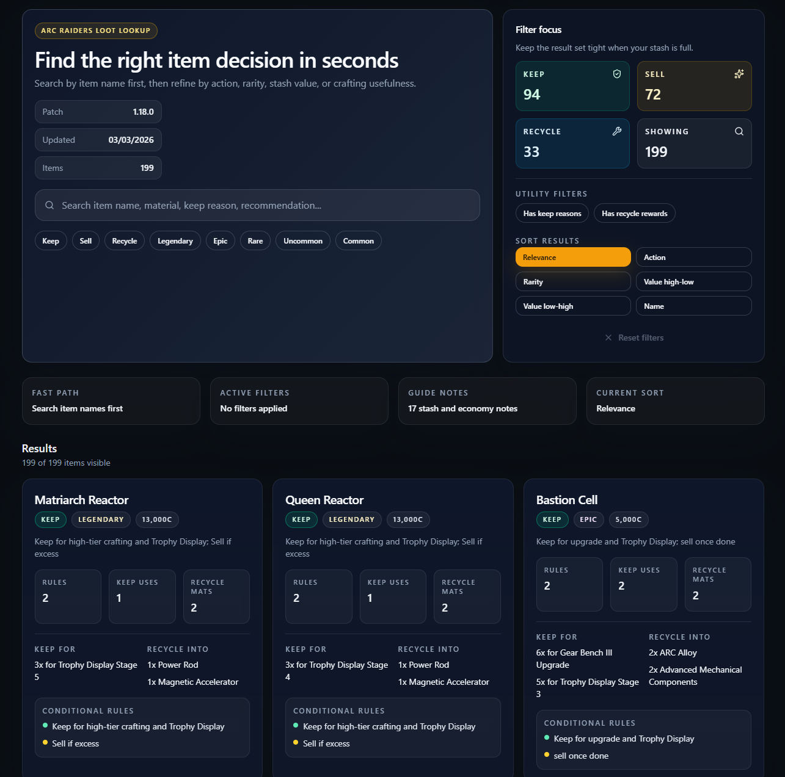

# ARC Raiders Loot Lookup

Fast, searchable loot guidance for ARC Raiders. Look up an item by name, then quickly decide whether to keep, sell, or recycle it based on stash value, rarity, crafting use, and rule-based notes.

Find it at: https://ryanws.tech/arc-raiders-loot/

Built for quick in-raid and stash-cleaning decisions, with a UI centered on name search first and fast filtering/sorting second.

## Highlights

- Search by item name, material, recommendation, or keep reason
- Filter by action, rarity, and utility flags
- Sort by relevance, action, rarity, value, or name
- Browse clear item cards with keep rules, upgrade uses, and recycle outputs

## Development

- Install: `bun install`
- Start: `bun run dev`
- Verify: `bun run precommit`

## Build

- Production build: `bun run build`
- Preview build: `bun run preview`
